  <!-- Animated Header Banner -->
  

   

  <!-- Dynamic Typing Subheading -->
  

   

  <!-- Animated Glowing Divider -->
  

## 🌌 About Me

👋 Hello there! I'm **S Karthik** (Karthik7661), a passionate developer specializing in **Artificial Intelligence**, **Deep Learning**, and **Quantum Machine Learning**. 

I enjoy solving real-world challenges, particularly in healthcare and intelligent systems. I leverage hybrid quantum-classical neural networks to push the boundaries of medical image classification and automated diagnostic systems.

- 🧠 Currently researching: **Quantum FiLM modulation** and **QCNN architectures** for brain tumor detection.
- 💻 Building: High-performance web applications and intuitive management systems.
- ⚡ Fun fact: I bridges the gap between quantum mechanics and deep learning!

  

## 🛠️ Technology Stack

<table width="100%">
  <tr>
    <td width="50%" valign="top">
      <h4>💻 Languages & Core</h4>
      
      
      
       
      
      
    </td>
    <td width="50%" valign="top">
      <h4>🧠 Deep Learning & AI</h4>
      
      
      
       
      
      
    </td>
  </tr>
  <tr>
    <td width="50%" valign="top">
      <h4>⚛️ Quantum ML</h4>
      
      
    </td>
    <td width="50%" valign="top">
      <h4>🌐 Web & DevOps</h4>
      
      
      
       
      
      
    </td>
  </tr>
</table>

  

## 🚀 Featured Projects

📂 Here are some of my top open-source projects:

### 🔬 Medical AI & Quantum Computing
*   **[Brain-Tumor-QCNN](https://github.com/Karthik7661/Brain-Tumor-QCNN)** 
    *   *Hybrid Quantum-Classical Neural Network (QCNN)* for automated brain tumor detection from MRI images.
    *   **Stack**: `Python` • `PennyLane` • `TensorFlow` • `EfficientNet-B0`
    *   *Highlight*: Combines deep classical feature extractions with a 4-qubit quantum variational classifier layer.
*   **[Brain-Tumor-QCNN-ResNet](https://github.com/Karthik7661/Brain-Tumor-QCNN-ResNet)**
    *   *Hybrid Quantum-Classical ResNet-18* using **Quantum FiLM** (Feature-wise Linear Modulation) layers.
    *   **Stack**: `Python` • `PyTorch` • `ResNet-18` • `Quantum Circuits`
    *   *Highlight*: Advanced multi-class MRI tumor detection with active quantum circuit integration.

### 💼 Application Development & Web Systems
*   **[Task-Management](https://github.com/Karthik7661/Task-Management)**
    *   A dynamic, collaborative task organizing system for teams.
    *   **Stack**: `TypeScript` • `React` • `Node.js` • `CSS Grid`
*   **[Rervestion_system](https://github.com/Karthik7661/Rervestion_system)**
    *   An optimized, robust reservation system for booking and managing resources.
    *   **Stack**: `TypeScript` • `Express` • `SQL`
*   **[portfolio](https://github.com/Karthik7661/portfolio)**
    *   My interactive, high-performance personal portfolio showcasing my projects and experience.
    *   **Stack**: `TypeScript` • `React` • `TailwindCSS` • `Framer Motion`

  

## 📊 Live GitHub Activity & Stats

  
  

  

  

## 🎮 Contribution Arena

Below is a live snake game tracking my coding activity. The snake eats food relative to my commits!
*(Refreshes automatically once a day)*

  

  

## 🤝 Let's Connect!

  
  

  

